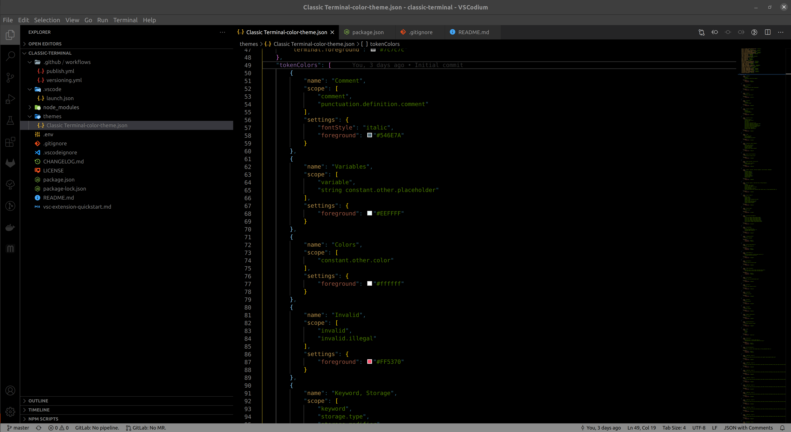

# README

This is a simple dark theme for visual studio code



## Installation

### VSCodium

Search for `classic-terminal` in the extension window. Alternatively download the package from [Open VSX Registry](https://open-vsx.org/extension/claudius/classic-terminal) and install it with:
```
Extensions: Install from VSIX..
```

### Visual Studio Code

Launch VS Code Quick Open (Ctrl+P), paste the following command, and press enter.
```
ext install Claudius.classic-terminal
```
Or download the vsix package from the [Visual Studio Code Marketplace](https://marketplace.visualstudio.com/items?itemName=Claudius.classic-terminal)


## Contribution

If you find any flaws please let me know and [create an issue](https://github.com/claudiuskastner/vscode-terminal-theme/issues/new/choose)
